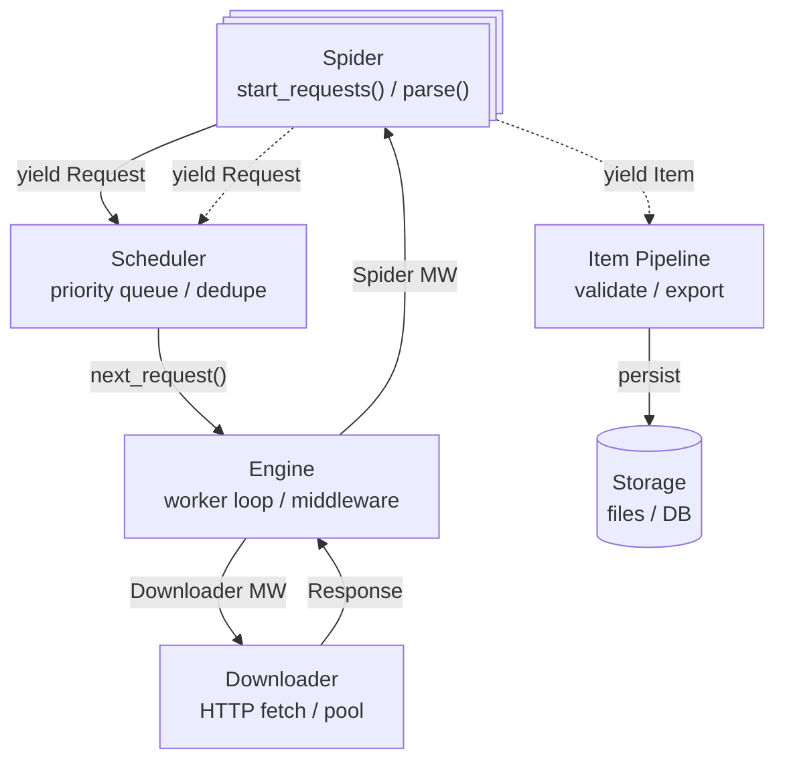

qCrawl is built on a modular architecture that separates concerns into distinct components, each with clear responsibilities. This design enables high extensibility through middlewares, pipelines, and signals while maintaining high performance through async/await concurrency.

## Architecture philosophy

1. **Separation of concerns**: Each component has a single, well-defined responsibility (scheduling, downloading, parsing, processing).
2. **Middleware-based extensibility**: Behavior can be customized by inserting middleware hooks at key points in the request/response flow.
3. **Async-first design**: Built on asyncio for concurrent I/O operations, allowing thousands of simultaneous requests.
4. **Event-driven observability**: A signals system enables monitoring, stats collection, and custom behavior without modifying core components.


## Core components

### Spider
**Responsibility**: Define crawling logic and data extraction.

- User-defined class that specifies `start_requests()` and `parse(response)`
- Yields Items (data) and Requests (follow links)
- Can override settings with `custom_settings`

**Location**: User code (not in qcrawl)

See: [Spider documentation](../concepts/spiders.md)

### Crawler
**Responsibility**: Orchestrate all components and manage their lifecycle.

- Creates and owns all components (Engine, Scheduler, Downloader, Middlewares, Pipelines)
- Manages settings precedence and resolution
- Handles spider lifecycle: `crawl()` → `stop()`

**Location**: `qcrawl/core/crawler.py`

### Engine
**Responsibility**: Central coordinator that runs the main event loop.

- Spawns worker tasks to process requests concurrently
- Executes middleware chains (downloader + spider)
- Routes Items to pipelines, Requests to scheduler
- Emits signals for observability

**Location**: `qcrawl/core/engine.py`

### Scheduler
**Responsibility**: Request queue, prioritization, and deduplication.

- Priority queue (higher priority = processed first)
- Deduplication using request fingerprinting
- Supports memory, disk, and Redis backends
- Direct delivery optimization for low-latency

**Location**: `qcrawl/core/scheduler.py`

See: [Scheduler implementation](scheduler.md) for internals

### Downloader
**Responsibility**: Perform HTTP requests asynchronously.

- Connection pooling via aiohttp
- Concurrency control per domain
- Timeout handling
- Signal emission for observability

**Settings**: `CONCURRENCY`, `CONCURRENCY_PER_DOMAIN`, `DOWNLOAD_TIMEOUT`

**Location**: `qcrawl/core/downloader.py`

### Item Pipeline
**Responsibility**: Process scraped items through validation, cleaning, and export.

- Async handlers that receive Items from spider
- Transform, validate, clean data
- Export to storage (files, databases, APIs)
- Can drop invalid items with `DropItem` exception

**Location**: `qcrawl/pipelines/manager.py`, `qcrawl/pipelines/base.py`

See: [Item Pipeline documentation](../concepts/item_pipeline.md)

### Middlewares
**Responsibility**: Customizable hooks around Spider and Downloader.

Two types:
- **DownloaderMiddleware** - Hooks around HTTP download (auth, retries, redirects)
- **SpiderMiddleware** - Hooks around spider processing (depth limits, filtering)

**Location**: `qcrawl/middleware/base.py`, `qcrawl/middleware/manager.py`

See: [Middleware development](middleware.md) for creating custom middlewares

### Signals & Stats
**Responsibility**: Event system for observability and extensibility.

- Signal dispatcher emits events at key lifecycle points
- Stats collector connects to signals to track metrics
- Custom handlers can observe or extend behavior

**Common signals**: `spider_opened`, `spider_closed`, `request_scheduled`, `response_received`, `item_scraped`

**Location**: `qcrawl/signals.py`, `qcrawl/stats.py`

See: [Signals reference](signals.md) for complete signal list and usage


## Request/response dataflow

### Simplified overview



### Request lifecycle

**1. Initialization**:
```
Crawler creates components → Spider.start_requests() → Requests enqueued in Scheduler
```

**2. Request processing (per worker)**:
```
Scheduler.next_request()
  ↓
Downloader Middleware chain (process_request)
  ↓
Downloader.fetch() - HTTP request
  ↓
Downloader Middleware chain (process_response, reversed)
  ↓
Response ready for spider
```

**3. Spider processing**:
```
Spider Middleware chain (process_spider_input)
  ↓
Spider.parse(response) - yields Items/Requests
  ↓
Spider Middleware chain (process_spider_output, reversed)
  ↓
Route: Items → Pipeline, Requests → Scheduler
```

**4. Signals emitted throughout**:
```
request_scheduled, response_received, item_scraped, bytes_received
  ↓
Stats collector updates counters
Custom handlers react to events
```


## Middleware execution flow

Middlewares execute in chains with priority-based ordering.

**Downloader Middleware**:
```
Request:  MW1 → MW2 → MW3 → Downloader
           ↓
Response: MW3 ← MW2 ← MW1 ← Downloader (reversed order)
```

**Spider Middleware**:
```
Input:  MW1 → MW2 → MW3 → Spider.parse()
         ↓
Output: MW3 ← MW2 ← MW1 ← Spider.parse() (reversed order)
```

**Middleware results**:

- `CONTINUE` - Continue to next middleware
- `KEEP` - Stop chain, use current value
- `RETRY` - Retry the request
- `DROP` - Drop the request/response

See: [Middleware development](middleware.md) for implementation details

## Extensibility points

qCrawl can be extended at multiple points:

**1. Custom middlewares**

- Hook into request/response processing
- Modify requests before download
- Filter or transform responses
- Handle errors and retries

See: [Middleware development](middleware.md)

**2. Custom pipelines**

- Validate scraped items
- Transform and clean data
- Export to custom storage
- Deduplicate items

See: [Item Pipeline documentation](../concepts/item_pipeline.md)

**3. Signal handlers**

- React to crawler events
- Collect custom metrics
- Trigger external actions
- Extend behavior without modifying core

See: [Signals reference](signals.md)

**4. Custom scheduler backends**

- Persistent scheduling (disk, Redis)
- Distributed scheduling across workers
- Custom priority algorithms
- External queue systems

See: [Scheduler implementation](scheduler.md)

**5. Custom exporters**

- Export to databases
- Stream to message queues
- Custom file formats
- Real-time processing

See: [Exporters documentation](../concepts/exporters.md)


## Settings precedence

Settings are merged with this priority (lowest to highest):

```
DEFAULT (qcrawl/settings.py)
  ↓
CONFIG_FILE (pyproject.toml)
  ↓
ENV (QCRAWL_* variables)
  ↓
SPIDER (spider.custom_settings)
  ↓
CLI (--setting arguments)
  ↓
EXPLICIT (runtime overrides)
```

Higher priority settings override lower ones.

See: [Settings documentation](../concepts/settings.md)


## File structure reference

**Core components**:

- `qcrawl/core/crawler.py` - Crawler orchestration
- `qcrawl/core/engine.py` - Engine worker loop
- `qcrawl/core/scheduler.py` - Request scheduling
- `qcrawl/core/downloader.py` - HTTP downloading
- `qcrawl/core/spider.py` - Base Spider class
- `qcrawl/core/request.py` - Request model
- `qcrawl/core/response.py` - Response model
- `qcrawl/core/item.py` - Item model

**Middleware system**:

- `qcrawl/middleware/base.py` - Base classes
- `qcrawl/middleware/manager.py` - Chain execution
- `qcrawl/middleware/downloader/` - Downloader middlewares
- `qcrawl/middleware/spider/` - Spider middlewares

**Pipeline system**:

- `qcrawl/pipelines/base.py` - Pipeline base
- `qcrawl/pipelines/manager.py` - Pipeline chain

**Exporters**:

- `qcrawl/exporters/base.py` - Exporter base
- `qcrawl/exporters/json.py` - JSON exporter
- `qcrawl/exporters/jsonlines.py` - JSON Lines exporter
- `qcrawl/exporters/csv.py` - CSV exporter

**Signals and stats**:

- `qcrawl/signals.py` - Signal dispatcher
- `qcrawl/stats.py` - Stats collector

**Configuration**:

- `qcrawl/settings.py` - Settings dataclass


## See also

- [Middleware development](middleware.md) - Create custom middlewares
- [Signals reference](signals.md) - Signal system and available signals
- [Scheduler implementation](scheduler.md) - Scheduling internals and backends
- [Spider documentation](../concepts/spiders.md) - Write spiders
- [Item Pipeline](../concepts/item_pipeline.md) - Process items
- [Settings reference](../concepts/settings.md) - Configuration options