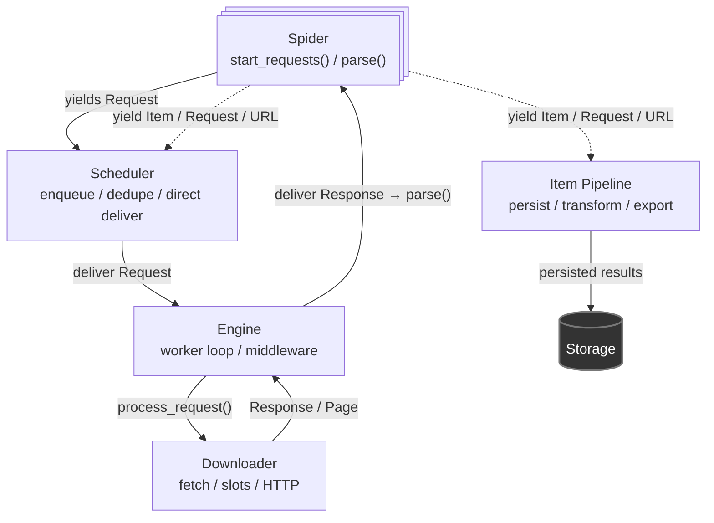
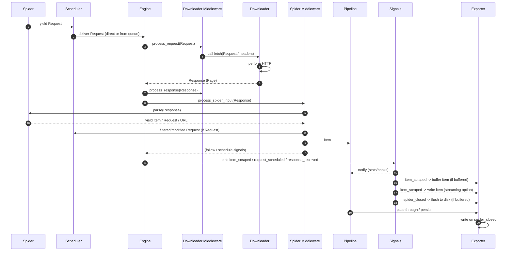

## High-level overview

qCrawl separates concerns into modular components with clear responsibilities.

1. **Spider** (parsing & data extraction) - user-defined class to define how to crawl and parse pages.
2. **Crawler** (orchestrating) - owns spider, engine, scheduler, downloader, pipelines, middlewares, signals, stats.
3. **Engine** (control flow) - central coordinator that glues together all components, runs the main loop, and manages dataflow.
4. **Scheduler** (scheduling) - request queue, prioritization, deduplication.
5. **Downloader** (downloading) - performs HTTP requests asynchronously, manages connections, timeouts, retries.
6. **Item pipeline** (item processing and persistence) - processes scraped items through a series of components for validation, cleaning, and exporting.
7. **Middlewares** (hooks & extensions) - customizable layers around Spider and Downloader for request/response processing.
8. **Signals & Stats** (observability) - event system for monitoring and extending behavior, collecting metrics.

### Simplified dataflow

 

### Sequence diagrams
Left-to-right are the participants; arrows are calls/messages/events in time order.

Arrow types:

- Solid line — used for explicit async calls / handoffs (caller awaits the receiver).
- Dotted line — used for async results, generator yields, buffered streams or events/signals (side-effects / notifications).
  

 
#### One request / response / item lifecycle

 

Step-by-step (what each arrow means):

1. Spider yields a `Request` (or `URL` string) to Scheduler.
2. Scheduler receives and either enqueues or directly delivers the `Request` to Engine. 
3. Engine calls downloader middleware `process_request` hooks (pre-download processing). 
4. Downloader middleware forwards the request to `Downloader.fetch()` (possibly altering headers/meta). 
5. Downloader performs the HTTP request (connection pool, slots, timeouts). 
6. Downloader returns a `Response/Page` to Engine and emits `response_received` / `bytes_received` signals. 
7. Engine runs downloader middleware process_response hooks (reversed order). 
8. Engine runs spider middleware `process_spider_input` before handing the Response to the spider. 
9. `Spider.parse(Response)` is invoked. 
10. Spider yields `Items`, `Requests` or `URL` strings back into the spider middleware chain. 
11. Spider middleware filters/modifies `Request` results and either forwards them to Scheduler or drops them. 
12. Spider middleware forwards `Items` into the `Pipeline` (or emits them). 
13. Spider middleware and/or Engine trigger follow/schedule control flows (e.g., scheduling new requests). 
14. Engine emits observability signals (e.g., `item_scraped, request_scheduled, response_received`). 
15. Signals are consumed by `StatsCollector` and other hooked handlers (update counters, metrics). 
16. Signals deliver items to `Exporter` (buffering). 
17. On `spider_closed` Signals tell `Exporter` to flush buffered items. 
18. `Pipeline` passes items to `Exporter` for final persistence (file, database, etc.).
19. `Exporter` writes items to disk or storage backend immediately (streaming) or buffers them.
20. If buffering is used, items are flushed on spider close.

### Quick mapping
- wiring & lifecycle: `qcrawl/core/crawler.py`
- engine/workers/middleware: `qcrawl/core/engine.py`
- scheduler semantics & dedupe: `qcrawl/core/scheduler.py`
- downloads, slots, signals emission: `qcrawl/core/downloader.py`
- middleware contracts and manager: `qcrawl/middleware/base.py`, `qcrawl/middleware/manager.py`
- pipelines: `qcrawl/pipeline/manager.py`, `qcrawl/pipeline/base.py`
- signals implementation: `qcrawl/signals.py`
