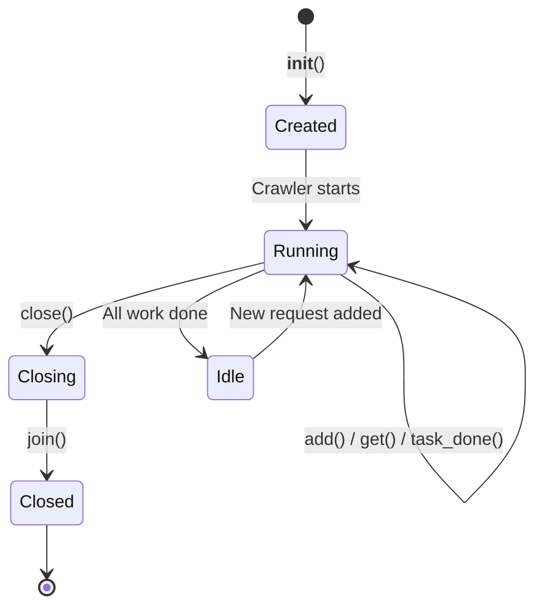

The Scheduler is responsible for managing the crawl queue, deduplicating requests, handling priorities, and coordinating request delivery to the engine's worker tasks.

## Key concepts

- **Queue**: Underlying storage backend for requests (memory, disk, Redis)
- **Fingerprinting**: URL normalization and deduplication mechanism
- **Priority**: Numeric value determining request processing order (higher = earlier)
- **Direct delivery**: Optimization that bypasses queue when consumers are waiting
- **Pending work**: Requests retrieved from scheduler but not yet completed
- **Backpressure**: Flow control mechanism to prevent memory overflow

## Features

- **Deduplication**: Automatic URL deduplication using request fingerprints
- **Priority-based ordering**: Higher priority requests are processed first
- **Direct delivery**: Requests delivered directly to waiting workers when possible
- **Multiple backends**: Supports memory, disk, and Redis queue implementations
- **Accurate tracking**: Maintains count of queued, pending, and seen requests
- **Graceful shutdown**: Clean shutdown with pending work completion


## Basic usage

The scheduler is automatically created and managed by the Crawler:

```python
from qcrawl.core.crawler import Crawler

async with Crawler(spider, settings) as crawler:
    # Scheduler is available as crawler.engine.scheduler
    scheduler = crawler.engine.scheduler

    # Check scheduler stats
    stats = await scheduler.stats()
    print(f"Queued: {stats['queued']}, Pending: {stats['pending']}")

    await crawler.crawl()
```


## Queue backends

### Memory queue (default)
Fast in-memory queue suitable for most crawls:

```toml title="settings.toml"
QUEUE_BACKEND = "memory"

[QUEUE_BACKENDS.memory]
class = "qcrawl.core.queues.memory.MemoryPriorityQueue"
maxsize = 0  # 0 = unlimited
```

**Characteristics:**

- Fast (no I/O)
- Lost on crash
- Limited by RAM
- Best for: Small to medium crawls, development

### Disk queue
Persistent queue stored on disk:

```toml title="settings.toml"
QUEUE_BACKEND = "disk"

[QUEUE_BACKENDS.disk]
class = "qcrawl.core.queues.disk.DiskQueue"
path = "/tmp/qcrawl_queue"
maxsize = 0
```

**Characteristics:**

- Persistent across restarts
- Slower than memory (disk I/O)
- Limited by disk space
- Best for: Long-running crawls, resumable crawls

### Redis queue
Distributed queue using Redis:

```toml title="settings.toml"
QUEUE_BACKEND = "redis"

[QUEUE_BACKENDS.redis]
class = "qcrawl.core.queues.redis.RedisQueue"
host = "localhost"
port = 6379
namespace = "qcrawl"
maxsize = 0
dedupe = true
update_priority = false
```

**Characteristics:**

- Shared across multiple crawlers
- Persistent (Redis configuration dependent)
- Network latency overhead
- Best for: Distributed crawling, large-scale crawls


## Request deduplication

Deduplication uses request fingerprinting to identify unique requests:

### Default fingerprinting
By default, fingerprints are computed from:

- URL (normalized)
- HTTP method
- Request body

```python
# These requests are considered duplicates:
Request(url="https://example.com/page?a=1&b=2")
Request(url="https://example.com/page?b=2&a=1")  # Same (query params sorted)
```

### Query parameter filtering
Control which query parameters are included in fingerprints:

```python
class MySpider(Spider):
    custom_settings = {
        # Ignore session/tracking parameters
        "IGNORE_QUERY_PARAMS": {"session_id", "utm_source", "utm_medium"},

        # OR keep only specific parameters
        # "KEEP_QUERY_PARAMS": {"id", "page"},
    }
```

**Note:** `IGNORE_QUERY_PARAMS` and `KEEP_QUERY_PARAMS` are mutually exclusive.


## Priority handling

Requests with higher priority values are processed first:

### Setting priority
```python
# High priority request (processed first)
yield Request(url="https://example.com/important", priority=100)

# Normal priority
yield Request(url="https://example.com/normal", priority=0)

# Low priority (processed last)
yield Request(url="https://example.com/less-important", priority=-10)
```

### Priority use cases
```python
async def parse(self, response):
    rv = self.response_view(response)

    # Prioritize category pages
    for category in rv.doc.cssselect("a.category"):
        yield rv.follow(category.get("href"), priority=50)

    # Normal priority for product pages
    for product in rv.doc.cssselect("a.product"):
        yield rv.follow(product.get("href"), priority=0)
```


## Direct delivery optimization

When worker tasks are waiting for requests, the scheduler delivers requests directly without queueing:

```
Worker waiting → Request added → Delivered immediately (no queue)
No workers waiting → Request added → Enqueued for later
```

This optimization:

- Reduces latency for first requests
- Minimizes memory usage
- Improves throughput


## Monitoring scheduler state

### Get scheduler statistics
```python
stats = await scheduler.stats()
print(stats)
# {
#     "queued": 150,        # Requests in queue
#     "pending": 10,        # Requests being processed
#     "seen": 1000,         # Total unique requests seen
#     "waiting_consumers": 0,  # Workers waiting for requests
#     "closed": 0           # Whether scheduler is closed
# }
```

### Check if scheduler is idle
```python
stats = await scheduler.stats()
is_idle = stats["queued"] == 0 and stats["pending"] == 0
```

### Monitor queue size
```python
queue_size = await scheduler.qsize()
print(f"Requests in queue: {queue_size}")
```


## Advanced usage

### Manual scheduler control
```python
from qcrawl.core.scheduler import Scheduler
from qcrawl.core.queues.memory import MemoryPriorityQueue
from qcrawl.utils.fingerprint import RequestFingerprinter

# Create scheduler manually
queue = MemoryPriorityQueue(maxsize=1000)
fingerprinter = RequestFingerprinter()
scheduler = Scheduler(queue=queue, fingerprinter=fingerprinter)

async with scheduler:
    # Add requests
    await scheduler.add("https://example.com")
    await scheduler.add(Request(url="https://example.com/page", priority=10))

    # Get next request
    request = await scheduler.get()

    # Process request...

    # Mark as done
    scheduler.task_done()

    # Wait for all work to complete
    await scheduler.join()
```

### Graceful shutdown
```python
# Close scheduler (prevents new adds)
await scheduler.close()

# Wait for pending work to complete
await scheduler.join()
```

### Custom queue backend
Implement the `RequestQueue` protocol:

```python
from qcrawl.core.queue import RequestQueue
from qcrawl.core.request import Request

class CustomQueue(RequestQueue):
    async def put(self, request: Request, priority: int = 0) -> None:
        """Add request to queue with priority."""
        # Your implementation
        pass

    async def get(self) -> Request:
        """Get next request (highest priority first)."""
        # Your implementation
        pass

    async def size(self) -> int:
        """Return number of queued requests."""
        # Your implementation
        pass

    async def close(self) -> None:
        """Close queue and cleanup resources."""
        # Your implementation
        pass
```

Register custom queue:
```toml title="settings.toml"
QUEUE_BACKEND = "custom"

[QUEUE_BACKENDS.custom]
class = "myproject.queues.CustomQueue"
# Additional configuration...
```


## Scheduler lifecycle



**States:**
- **Created**: Scheduler initialized but not yet used
- **Running**: Actively processing requests
- **Idle**: No pending work (queue empty, no requests being processed)
- **Closing**: Shutdown initiated, no new requests accepted
- **Closed**: All resources cleaned up


## Backpressure handling

When the queue reaches `maxsize`, new requests are dropped:

```python
# Configure maximum queue size
[QUEUE_BACKENDS.memory]
maxsize = 10000  # Drop new requests when queue is full
```

Monitor dropped requests:
```python
# Dropped requests are logged as warnings
# Check logs: "Queue full, dropping request: {url}"
```

Alternative: Use Redis with unlimited size and external monitoring:
```toml
[QUEUE_BACKENDS.redis]
maxsize = 0  # Unlimited (monitor Redis memory externally)
```


## Best practices

- **Choose appropriate backend**: Memory for small crawls, Redis for distributed/large crawls
- **Set reasonable priorities**: Use priority sparingly; most requests should be priority 0
- **Monitor queue growth**: Track `queued` stat to detect runaway crawls
- **Configure backpressure**: Set `maxsize` to prevent memory overflow
- **Filter query parameters**: Use `IGNORE_QUERY_PARAMS` for session/tracking parameters
- **Graceful shutdown**: Always call `close()` and `join()` for clean shutdown
- **Avoid blocking operations**: Scheduler methods are async; don't block the event loop

For practical crawling patterns using scheduler features (breadth-first, depth-first, focused crawling), see [Crawl Ordering](../advanced_topics/crawl_ordering.md).


## Troubleshooting

### Queue fills up quickly
- Reduce `CONCURRENCY` to slow down request generation
- Increase `DELAY_PER_DOMAIN` to space out requests
- Set `MAX_DEPTH` to limit crawl scope
- Increase `maxsize` or use unlimited queue

### Duplicate requests
- Check fingerprinting configuration
- Verify `IGNORE_QUERY_PARAMS` / `KEEP_QUERY_PARAMS` settings
- URLs may differ in fragments, schemes, or normalization

### Requests not being processed
- Check scheduler stats: `await scheduler.stats()`
- Verify workers are running: Check engine concurrency settings
- Look for exceptions in worker tasks


## Implementation details

- Scheduler code: `qcrawl/core/scheduler.py`
- Queue backends: `qcrawl/core/queues/`
- Fingerprinting: `qcrawl/utils/fingerprint.py`
- Priority is stored as request attribute and used by queue backend
- Direct delivery uses asyncio Futures to minimize latency
- Deduplication uses in-memory set of fingerprints (not persistent)
- `pending` counter tracks work in progress for accurate idle detection
